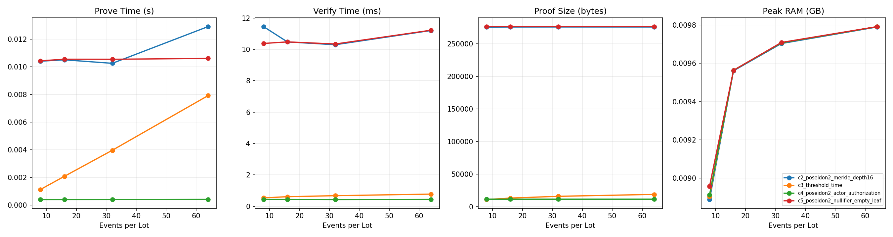

# Báo cáo tiến độ thực nghiệm E1 - Cryptographic Benchmark

Ngày lập báo cáo: 22/05/2026

## 1. Mục tiêu thực nghiệm

Thực nghiệm E1 dùng để đánh giá chi phí mật mã của hướng "EPCIS-Aware Recursive Zero-Knowledge Rollup for EUDR Traceability". Mục tiêu ở giai đoạn này là kiểm tra tính khả thi của pipeline Plonky2: tạo proof cho từng sub-circuit C1-C5, sau đó gom các proof này bằng recursive wrapper.

Kết quả trong báo cáo này là kết quả benchmark kỹ thuật để báo cáo tiến độ. Đây chưa phải số liệu paper-final vì C4 chưa phải Ed25519/EdDSA production circuit và proof size thực tế chưa đạt mục tiêu 196 bytes.

## 2. Môi trường và cách chạy

Thực nghiệm strict được chạy bằng lệnh:

```bash
make e1-strict
```

Thông tin môi trường được ghi trong `results/e1_metadata.json`:

| Hạng mục | Giá trị |
|---|---|
| Rust | `rustc 1.97.0-nightly (e50aa6fba 2026-05-19)` |
| Python | `3.9.6` |
| OS | `macOS-26.4.1-arm64-arm-64bit` |
| RAM measurement backend | `getrusage_ru_maxrss` |
| Plonky2 dependency | pinned rev `5d9da5a65bbcba2c66eb29c035090eb2e9ccb05f` |
| Proof size policy | đo proof Plonky2 thật, không ép về 196 bytes |

Các file kết quả chính:

- Raw data: `results/e1_raw.csv`
- Bảng thống kê bootstrap CI: `results/e1_table1.csv`
- Biểu đồ: `results/e1_plots.png`
- Metadata môi trường: `results/e1_metadata.json`
- Report tự động ngắn: `results/e1_report.md`

## 3. Thiết kế benchmark

Benchmark chạy với `events_per_lot = 8, 16, 32, 64`, mỗi cell có `30 seed`. Tổng cộng có 6 circuit rows gồm C1-C5 và recursive wrapper, tương ứng `720` dòng raw data.

| Circuit | Vai trò | Trạng thái hiện tại |
|---|---|---|
| `c1_polygon_outside` | Geofence: chứng minh tọa độ không nằm trong vùng cấm | meaningful Plonky2 circuit |
| `c2_poseidon_merkle_depth16` | Certificate membership với Poseidon Merkle tree depth 16 | meaningful Plonky2 circuit |
| `c3_threshold_time` | Sensor threshold và timestamp monotonic | meaningful Plonky2 circuit |
| `c4_eddsa_style_proxy` | Batch signature verification | proxy/blocker, chưa phải Ed25519/EdDSA thật |
| `c5_poseidon_nullifier_empty_leaf` | Nullifier derivation và empty-leaf non-membership | meaningful Plonky2 circuit |
| `wrapper_recursive_plonky2` | Recursive wrapper verify proof C1-C5 | recursive Plonky2 proof thật |

## 4. Kết quả tổng hợp

Số liệu dưới đây lấy từ `results/e1_report.md`. Mỗi circuit có 120 dòng, tương ứng 4 event sizes x 30 seeds.

| Circuit | Rows | Mean prove time (s) | Mean verify time (ms) | Mean proof size (bytes) | Gap so với 196 bytes |
|---|---:|---:|---:|---:|---:|
| `c1_polygon_outside` | 120 | 0.030891 | 2.499 | 88,285.4 | 88,089.4 |
| `c2_poseidon_merkle_depth16` | 120 | 0.015040 | 1.756 | 69,244.7 | 69,048.7 |
| `c3_threshold_time` | 120 | 0.021471 | 2.222 | 80,507.4 | 80,311.4 |
| `c4_eddsa_style_proxy` | 120 | 0.019320 | 2.064 | 75,464.4 | 75,268.4 |
| `c5_poseidon_nullifier_empty_leaf` | 120 | 0.015428 | 1.755 | 69,210.4 | 69,014.4 |
| `wrapper_recursive_plonky2` | 120 | 1.109640 | 4.503 | 132,886.0 | 132,690.0 |

Biểu đồ tổng hợp prove time, verify time, proof size và peak RAM nằm tại:



## 5. Nhận xét chính

Pipeline benchmark đã chạy đầy đủ theo grid strict: 4 mức events/lot, 30 seed/cell, 6 circuit rows, tổng 720 dòng. Các output raw CSV, summary table, plot và metadata đều được sinh tự động từ Makefile.

Các sub-circuit C1, C2, C3 và C5 hiện đã có constraints có ý nghĩa, không còn là placeholder đơn giản. C2 và C5 đã dùng Merkle tree depth 16, tức cùng quy mô 65,536 leaves như guide đặt ra.

Recursive wrapper chạy được và verify pass. Thời gian prove trung bình của wrapper khoảng 1.11 giây, cao hơn các sub-circuit riêng lẻ như kỳ vọng. Verify time của wrapper vẫn thấp, trung bình khoảng 4.5 ms.

Proof size hiện được đo trung thực từ compressed Plonky2 proof. Kích thước proof thực tế đang lớn hơn nhiều so với mục tiêu 196 bytes trong paper. Vì vậy kết quả hiện tại chỉ chứng minh pipeline chạy được, chưa chứng minh đạt mục tiêu proof compression cuối cùng.

## 6. Giới hạn quan trọng về C4

C4 hiện có tên `c4_eddsa_style_proxy`, nhưng chưa phải Ed25519/EdDSA thật. Circuit hiện tại kiểm tra một phương trình chữ ký kiểu Schnorr-like trên field để đo chi phí của một signature-like algebraic circuit. Metadata cũng ghi rõ trạng thái:

```text
explicit algebraic proxy/blocker until a compatible Ed25519/EdDSA Plonky2 gadget is integrated
```

Do đó, không được dùng số liệu C4 hiện tại để claim rằng hệ thống đã benchmark EdDSA production verification. Số liệu C4 chỉ dùng để minh bạch pipeline và đo tạm chi phí của một proxy có ràng buộc mật mã.

## 7. Đánh giá khả thi

Phần đã xác thực khả thi:

- Pipeline Rust/Plonky2 chạy được từ Makefile.
- C1, C2, C3 và C5 có circuit constraints meaningful.
- Recursive wrapper verify được các inner proof C1-C5.
- Benchmark full grid sinh đủ 720 dòng và có thể tái lập từ `make e1-strict`.
- Analysis script sinh được CSV summary, bootstrap CI, PNG plots và metadata môi trường.

Phần chưa xác thực final:

- C4 chưa phải Ed25519/EdDSA production circuit.
- Proof size chưa đạt mục tiêu 196 bytes.
- Kết quả đang chạy trên macOS local, chưa phải phần cứng mục tiêu trong guide.
- Số liệu hiện tại chưa nên đưa vào paper như kết quả cuối cùng, chỉ nên dùng làm feasibility/progress benchmark.

## 8. Hướng tiếp theo

Ưu tiên tiếp theo là xử lý C4. Có hai hướng: tích hợp gadget Ed25519/EdDSA tương thích Plonky2, hoặc ghi C4 là blocker chính thức nếu dependency không khả thi trong thời gian ngắn. Sau khi có C4 thật, cần chạy lại toàn bộ `make e1-strict`.

Sau C4, cần tối ưu recursive wrapper và proof representation để giảm proof size. Hiện proof size trung bình của wrapper là khoảng 132.9 KB, còn mục tiêu paper là 196 bytes, nên đây là khoảng cách kỹ thuật lớn cần được trình bày trung thực.

Cuối cùng, nên chạy lại benchmark trên môi trường phần cứng mục tiêu hoặc một máy Linux tương đương guide. Khi đó RAM measurement sẽ dùng `/proc/self/status` `VmPeak`, sát đặc tả hơn so với fallback `getrusage` trên macOS.

## 9. Kết luận ngắn

E1 hiện đã chứng minh được hướng pipeline Plonky2 + recursive wrapper là khả thi ở mức feasibility benchmark. Hệ thống tạo được proof, verify được proof, gom proof bằng recursive wrapper và sinh đầy đủ kết quả benchmark theo grid strict.

Tuy nhiên, kết quả chưa đủ để claim paper-final vì C4 EdDSA thật chưa được triển khai và proof size chưa đạt target 196 bytes. Báo cáo này nên được dùng để trình bày tiến độ, các kết quả đã xác thực, và các điểm còn phải hoàn thiện trước khi đưa vào paper.
